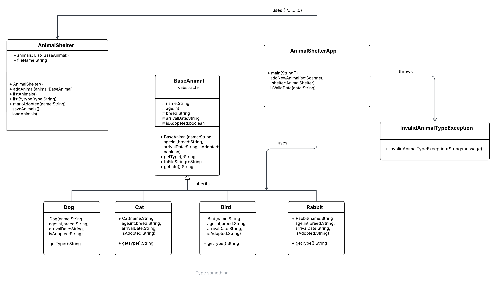

#  Animal Shelter Management System (Java Console App)

## Description
This is a simple **Java console-based Animal Shelter Management System** that allows users to:
-  Add new animals (Dog, Cat, Bird, Rabbit)
-  Record animal details (name, age, type, breed, arrival date)
-  List all animals
-  Mark animals as adopted
-  Save and load data from a text file

The system ensures:
-  Only allowed animal types (Dog, Cat, Bird, Rabbit)
-  Valid date format using regular expressions (`yyyy/MM/dd`)
-  Input safety with number and string validation

---

##  Features
-  **Add New Animal**
    - Enter animal type (Dog/Cat/Bird/Rabbit)
    - Enter name, age, breed, arrival date
    - Validates numeric and date formats

-  **List All Animals**
    - Displays animal details with adoption status

-  **Select Animal Type**
    - Ensures only valid types (Dog, Cat, Bird, Rabbit) are accepted

-  **Mark as Adopted**
    - Change adoption status of an animal by name

-  **File Storage**
    - Saves and loads animal data from a text file for data persistence

## Class Digaram
  

## Installation
1. Clone the repository:
   ```bash
   git clone https://github.com/your-username/animal-shelter-management.git
   cd animal-shelter-management
## Contributors
1.Thant Htoo San
2. Hein Zaw
3. Nyan Sint Zaw
4. Nedi Zeya
5. Min Thein Kyaw
